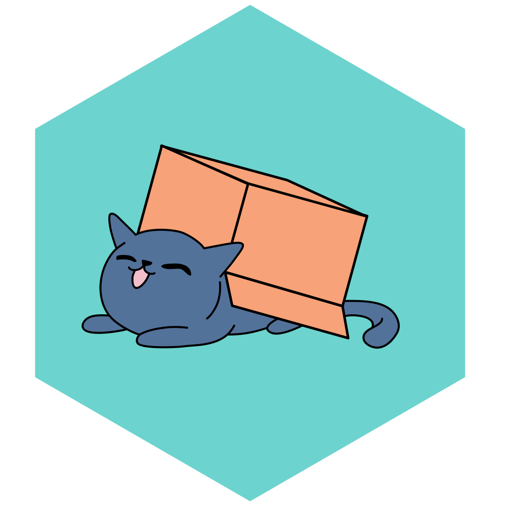
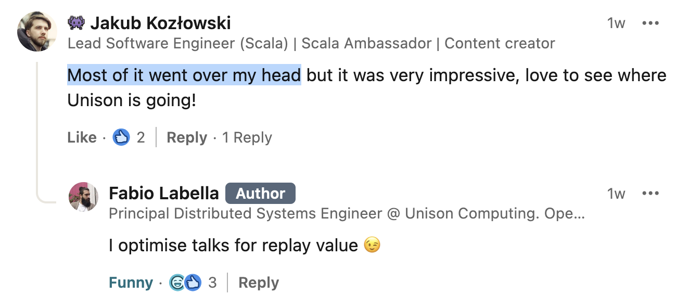
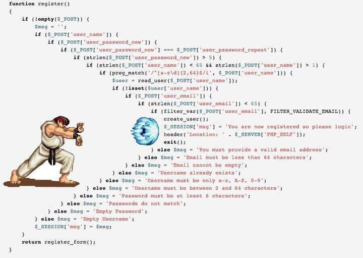

# <a href="https://armanbilge.com/calico/" target="_blank">Calico</a> – the functional frontend library you didn’t know you needed
## Jakub Kozłowski | Art Of Scala | 10.10.2024, Warsaw
Slides, contact etc.: https://linktr.ee/kubukoz

<div style="width: 100%; text-align: center">
  <br/>
  <a href="https://typelevel.org" target="_blank"></a>
  <a href="https://typelevel.org/cats-effect" target="_blank"></a>
  <a href="https://fs2.io" target="_blank"></a>
</div>


---

## ⚠️ Warning: optimized for replay value™️

<div style="width: 100%; text-align: center">
  
</div>

Check out **the recording, slides and links** later!

---

```scala mdoc:js:shared:invisible
import scalajs.js
import cats.syntax.all.*
import calico.html.io.*
import calico.html.io.given
import calico.syntax.*
import calico.syntax.given
import cats.effect.IO
import cats.effect.Ref
import cats.effect.Resource
import fs2.dom.Node
import org.scalajs.dom
import fs2.concurrent.Signal
import fs2.concurrent.SignallingRef
import fs2.Chunk
import org.http4s.dom.*
import org.http4s.implicits.*
import demo.IntersectionObserver
import demo.WebSocketStreamClient
import demo.WebSocketStreamClient.*
import scala.concurrent.duration.{span => _, *}
import cats.effect.unsafe.implicits.*

extension [A <: Node[IO]](ioRes: Resource[IO, A]) {
  def renderHere(node: dom.Node) = {
    ioRes
      .renderInto(node.asInstanceOf[Node[IO]])
      .useForever.unsafeRunAndForget()
  }
}
```

```scala
// core idea
val component: Resource[IO, HtmlElement[IO]] = ???
```

---

## `cats.effect.Resource`

```scala
trait Resource[F[_], A] {
  def use[B](f: A => F[B]): F[B]
}

object Resource {
  def make[F[_], A](acquire: F[A])(release: A => F[Unit]): Resource[F, A]
}
```

Encapsulates the lifecycle of a stateful resource: **allocation** -> usage -> **cleanup**.

---

## Resource composition? 😬

```scala
mkConnection.use { conn =>
  makeClient(conn).use { client =>
    makeServer(conn).use { server =>
      client.call(server)
    }
  }
}
```

Looks familiar...

---



---

## Resource composition: ✨ `flatMap` ✨

```scala
val myApp = for {
  conn   <- mkConnection
  client <- makeClient(conn)
  server <- makeServer(conn)
} yield (client, server)

myApp.use { (client, server) =>
  client.call(server)
}
```

---

## Components in Calico are Resources...

...on steroids!

```scala
// tired
val myComponent = for {
  div1 <- div("Hello, world!")
  div2 <- div("Goodbye, world!")
} yield div(div1, div2)

// wired
val myComponent = div(
  div("Hello, world!"),
  div("Goodbye, world!")
)
```

---

## OK, we have a component that's a resource.

Now what?

```scala mdoc:js
val comp = div(
  "Hello!",
  " ",
  button("Click me!"),
)

// custom helper I'm using for the slides, you don't have to do this
comp.renderHere(node)
```

---

## We can add listeners...

```scala mdoc:js
button(
  onClick(IO(dom.window.alert("Button clicked!"))),
  "Click me!"
)
.renderHere(node)
```

---

## We can get state out of the DOM...

```scala mdoc:js
input.withSelf { self =>
  onChange(self.value.get.flatMap { value => IO(dom.window.alert(value))})
}
.renderHere(node)
```

---

```scala mdoc:js
fs2.Stream.awakeEvery[IO](100.millis).holdResource(0.seconds).flatMap { signal =>
  div(
    "The presentation has been running for ",
    signal.map(_.toSeconds.toString),
    " seconds."
  )
}
.renderHere(node)
```

---

```scala mdoc:js
SignallingRef[IO].of("").toResource.flatMap { ref =>
  form(
    input.withSelf { self =>
      (
        value <-- ref,
        onInput(self.value.get.flatMap(ref.set)),
        placeholder := "What's your name?"
      )
    },
    div("Hello, ", ref, "!")
  )
}
.renderHere(node)
```

---

```scala mdoc:js
SignallingRef[IO].of(List.empty[String]).toResource.flatMap { log =>
  SignallingRef[IO].of("").toResource.flatMap { ref =>
    div(
      form(
        input.withSelf { self =>
          (
            value <-- ref,
            onInput(self.value.get.flatMap(ref.set))
          )
        },
        onSubmit(_.preventDefault *> ref.get.flatMap(v => log.update(_ :+ v)) *> ref.set(""))
      ),
      ul(children <-- log.map(_.map(li(_))))
    )
  }
}
.renderHere(node)
```

---

```scala mdoc:js
val mouseEvents = fs2.dom.events[IO, dom.MouseEvent](dom.document, "mousemove")

mouseEvents.map(e => (e.clientX, e.clientY)).holdResource((0, 0)).flatMap {
  sig => div(sig.map(_.toString))
}
.renderHere(node)
```

---

Some setup...

```scala mdoc:js:shared
def keyboardEvent(key: Char, tpe: String) =
  fs2.dom.events[IO, dom.KeyboardEvent](dom.document, tpe).filter(_.key == key.toString)

def keyEvents(key: Char) =
  keyboardEvent(key, "keydown").either(
    keyboardEvent(key, "keyup")
  ).map(_.isLeft)

def showBool(b: Boolean) = if b then "✅" else "❌"
```

And the show begins!

```scala mdoc:js
keyEvents('k')
  .holdResource(false)
  .flatMap {
    sig => div("k: ", sig.map(showBool))
  }
  .renderHere(node)
```

---

```scala mdoc:js
def showLetter(k: Char, state: Signal[IO, Boolean]) =
  div(code(k.toString), ": ", state.map(showBool))

"qwerty"
  .toList
  .traverse { key =>
    keyEvents(key).holdResource(false).tupleLeft(key)
  }
  .flatMap {
    signals => div(signals.map(showLetter))
  }
  .renderHere(node)
```

---

```scala mdoc:js:shared
import org.http4s.client.websocket.{WSRequest, WSFrame}

// Implementation of unstable web API: https://github.com/http4s/http4s-dom/pull/384
val wsMessages = WebSocketStreamClient[IO].withFallback(WebSocketClient[IO])
  .connectHighLevel(
    WSRequest(uri"ws://localhost:8080")
  )
  .flatMap {
    _.receiveStream.collect { case WSFrame.Text(text, _) => text }
      .filterNot(_.isBlank)
      .sliding(10).map(lines => div(lines.map(p(_)).toList))
      .metered(1.second / 5)
      .holdOptionResource
  }

def shrek(node: org.scalajs.dom.Element) = IntersectionObserver.isVisible(node).flatMap { visible =>
  div(
    visible.map {
      case true  => div(wsMessages)
      case false => div("")
    }
  )
}.renderHere(node)
```

---

```scala mdoc:js
shrek(node)
```

---

_Actually_ pure FP

```scala mdoc:js
val component = SignallingRef[IO].of(0).toResource.flatMap { ref =>
  button(
    onClick(ref.update(_ + 1)),
    "Clicks: ", ref.map(_.toString),

    styleAttr <-- ref.map(s => s"font-size: ${(s + 1)}em")
  )
}

div(component, component).renderHere(node)
```
