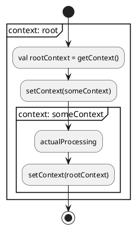
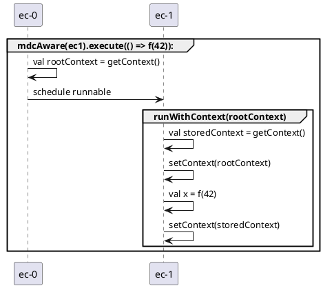
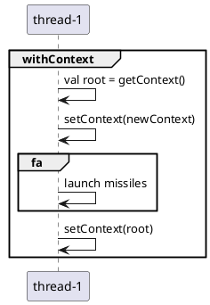
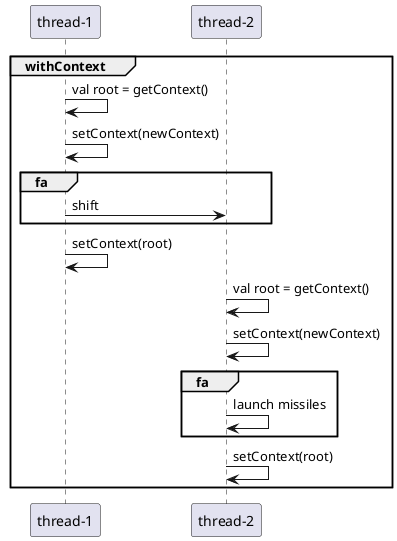
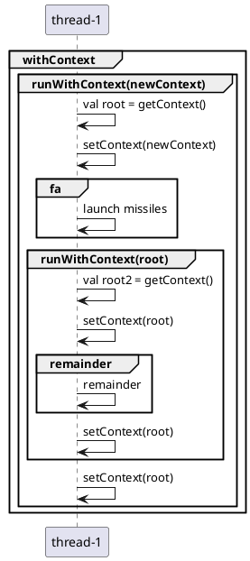
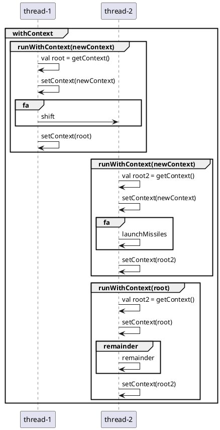

---



---

```scala
withContext(newContext)(launchMissiles)
```

Assume starting with root context



---

```scala
withContext(newContext)(IO.shift(mdcAware(ec)) *> launchMissiles)
```


---

```scala
withContext(newContext)(launchMissiles) *> remainder
```


---

```scala
withContext(newContext)(IO.shift *> launchMissiles) *> remainder
```


